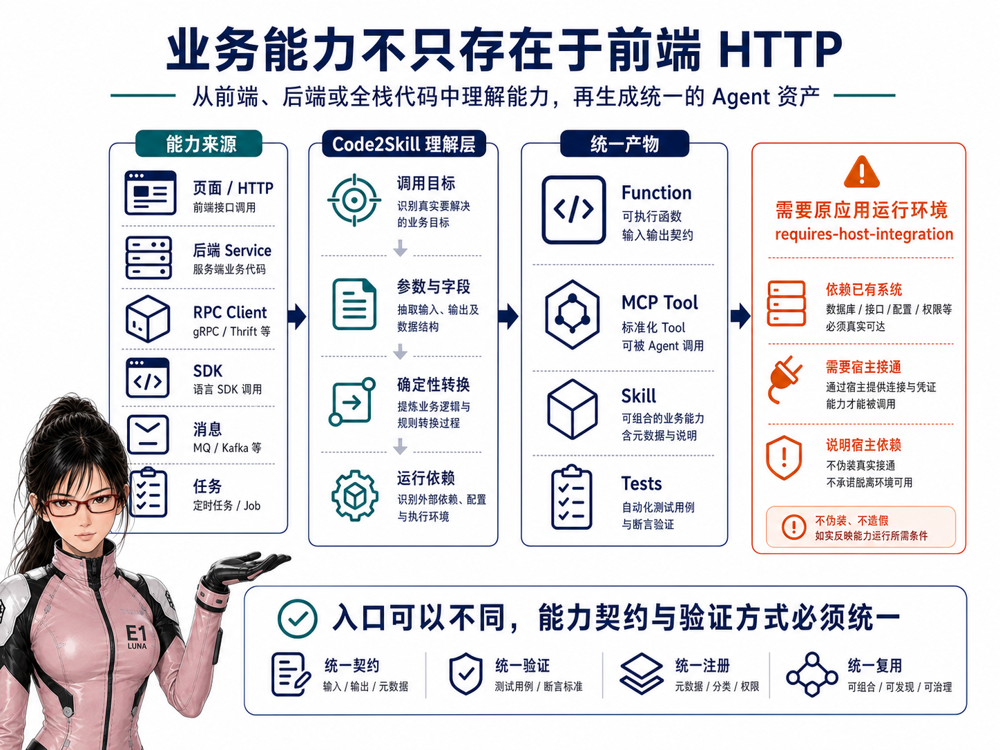
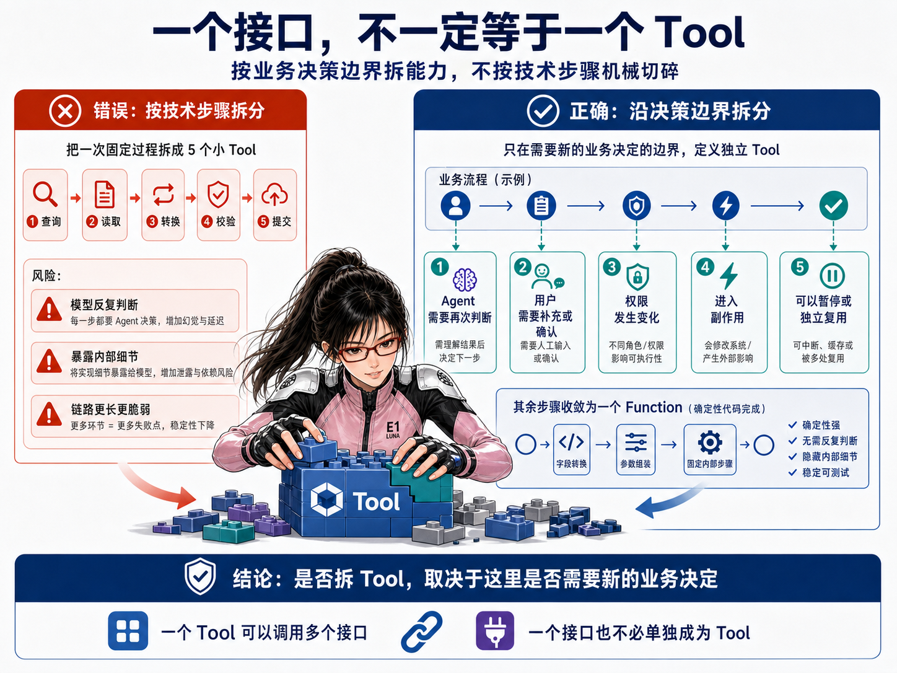
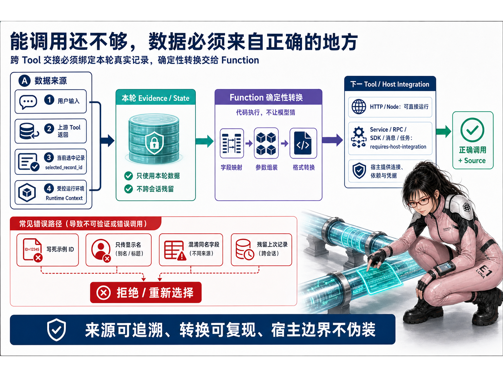

# Code2Skill：把前后端代码变成 Agent 能力

> 当前版本：Code2Skill v1.1.3

Code2Skill 是一组交给编程 Agent 使用的生成与检查 Skill。你提供一个已有代码目录和希望处理的功能，它会阅读相关源码，找出已经存在的业务调用与数据关系，再生成 Function、MCP Tool、Agent Skill、离线测试和安装说明。

它想解决的问题很直接：很多业务能力原本已经存在于页面、接口或后端服务中，但要让 Agent 使用，开发者往往还要重新理解代码、包装调用、编写说明并补测试。Code2Skill 尝试把这部分重复工作先生成一份可运行或可接入、可审核、可继续修改的初稿，而不是要求团队重新开发一套业务接口。

最短的使用方式，就是在目标代码仓库中告诉编程 Agent：

```text
使用 $code2skill-generate，处理 <代码路径> 中的 <一个小功能>。
```

相关阅读：《Code2Skill：不用重写业务接口，把现有代码生成 MCP 和 Agent Skill》

从最初版本到当前 v1.1.3，我主要补了两件事：

1. **能看的代码更多了**：不只理解页面和 HTTP 请求，也能从后端公开调用入口中发现能力；暂时无法独立接通的运行环境，会明确说明缺什么。
2. **复杂工作更不容易乱走了**：生成前会先理解事情应该怎样完成，缺信息时先问、需要校验时先校验、写入前适当确认，遇到失败或无法确定时停下来。

简单的只读查询仍然可以保持简单，不会为了显得“智能”而被强行包装成复杂流程。

## 1. 现在不只会看前端页面，后端已有能力也能利用起来

第一版最容易理解的输入，是一个前端页面或功能目录。但真实项目里的业务能力并不都写在页面里，它也可能存在于后端 Service、RPC Client、SDK、消息生产者或任务提交器中。



现在可以把这些后端公开调用入口也交给 Code2Skill。它会尝试理解：这个入口解决什么问题、需要哪些参数、返回什么结果，以及调用失败时应该怎样处理。

例如，一个项目可能没有为某项查询单独开发页面，却已经在后端提供了公开的查询 Service。以前这项能力很容易被漏掉；现在 Code2Skill 可以从这个调用入口理解它，并把它整理成 Agent 能使用的能力。对使用者来说，重点不是底层采用哪种协议，而是：**原有系统里更多已经存在的能力，有机会被重新利用起来。**

这里并不是说 Code2Skill 已经能自动接通所有 Java、Dubbo、Python 或 MQ 环境。

- 项目已有安全、可复用的调用客户端时，可以在它上面生成一层薄包装；
- 调用依赖原有容器、依赖注入、RPC Client、Broker 或特定 SDK 时，生成结果会明确标记“需要接入宿主系统”，并给出能力契约、字段映射、接入说明和缺口。

换句话说：**能直接运行的就交付可运行初稿；暂时接不上的，就诚实说明接在哪里、还缺什么，而不是假装已经跑通。**

## 2. 现在不只生成一组 Tool，也会尽量还原完成工作的关键步骤

这一轮更重要的变化，不是多支持了几个接口，而是生成方式发生了变化。

以前，生成器比较容易得到“一组可以调用的接口”。但接口都能调用，不代表 Agent 就知道什么时候该查询、什么时候该补问、什么时候应该停止，更不代表它知道写入前是否需要让用户看一眼。

现在，Code2Skill 会先尝试理清完成目标所需的最小路径：缺什么信息、先查什么、在哪里选择或校验、什么情况必须停止、什么时候可以写入，以及源码里是否还有结果查询或对账能力。



举一个不依赖具体业务的例子。

假设用户希望从一批可处理记录中选择一条，并提交一次更新。

**以前可能生成的是：**

> 查询接口、详情接口、校验接口和提交接口都已经准备好了，请 Agent 自己想办法调用。

这样做可能出现几种问题：用户还没有给出必要信息，Agent 就尝试提交；预校验已经失败，它仍继续向下执行；或者为了对应每个接口，把本来固定的字段转换也拆成一步，让模型反复判断。

**现在更接近下面的过程：**

这不是所有功能都必须执行的固定六步，而是一个存在查询、选择和写入边界时的代表性例子。

1. 先检查完成目标还缺哪些信息，缺少时向用户补问；
2. 查询候选记录，让用户或 Agent 根据结果完成选择；
3. 调用预校验，失败时停止并解释原因；
4. 写入前展示关键内容，在适当场景等待确认；
5. 确认后正式提交；
6. 如果源码提供结果查询或对账入口，再检查最终状态。

用户能够感知到的变化是：**Agent 更像是在认真把事情办完，而不是拿到几个接口后盲目尝试。**

这也不是把 Agent 变成固定工作流机器。Skill 只保存通常路径、可跳过条件、补问位置、停止点和写入边界；Agent 仍可以根据实际返回结果调整顺序、组合能力或继续询问。简单查询没有这些决策点时，仍然只生成简单查询。

技术上，Code2Skill 只会在确实需要重新判断、权限发生变化或即将产生副作用的位置拆开可调用能力。Agent 的补问和用户确认本身不是 Tool；日期格式化、字段改名、请求组装等固定步骤也继续由普通函数完成，不交给模型猜。

### 查询后选中了谁，后续就继续使用谁

连续操作还有一个很隐蔽的问题：接口都调用成功了，但后续写入的数据未必来自用户本轮选中的记录。



举个更具体的例子：用户先让 Agent 查询“我有哪些待处理记录”，系统返回三条结果。用户接着说：“给第二条补一段备注。”

这时，新增备注所需的记录 ID、记录类型和版本信息，都应该来自刚才查询结果中的第二条。Agent 不能使用代码示例里写死的 ID，也不能误用第一条记录，更不能沿用上一次对话处理过的对象。

Code2Skill 现在会更重视这种前后衔接，并生成相应的检查：先让 Agent 选择第一条，再改为选择第二条，随后观察提交参数是否已经完整切换到第二条。只要还有一个关键字段来自第一条，就说明生成的能力存在串数据风险。

所以这项优化解决的不是“接口能不能调用”，而是“连续几步操作时，Agent 有没有始终处理用户刚刚选中的那个对象”。查询、选择、校验和写入只有围绕同一条记录正确衔接，整个功能才真正可靠。

Code2Skill 仍不会承诺自动发现源码没有表达的全部业务规则。生成结果是可运行或可接入、可审核的初稿，仍需要使用者结合业务理解检查，并在授权环境中测试。

## 3. 从一个目录、一个目标开始试

Code2Skill 发布后，已经有人在外部环境中完成发现、安装、安全检查和实际调用。这说明它不再只是作者本机上的演示，但也不代表已经替使用者完成了业务审核或生产验证。


如果你想判断这次更新对自己有没有用，不必先选一套复杂系统。找一个熟悉的只读查询或小功能，把代码目录和目标告诉编程 Agent 即可：

```text
使用 $code2skill-generate，处理 <代码路径> 中的 <一个小功能>。
```

Code2Skill 会尝试识别真实调用入口，并生成 Function、MCP Tool、Skill、离线测试和安装说明。

三个 Skill 可以固定到 v1.1.3 安装：

```bash
dsh plugin --profile web add github:leechen298/Code2Skill#v1.1.3
```

也可以使用通用 Skills CLI：

```bash
npx skills add leechen298/Code2Skill \
  --skill code2skill-generate code2skill-review-flow code2skill-review-source \
  --agent "$AGENT_ID" --global --yes
```

当前默认的自动运行验证主要覆盖 Node stdio。其他语言或运行环境如果需要原系统参与，生成结果会明确保留接入说明和未验证边界，需要你完成接入后继续测试。

## 欢迎从一个熟悉的小功能开始

这次更新可以概括成一句话：**Code2Skill 不只开始理解更多代码入口，也开始更认真地理解这些能力应该怎样一起工作。**

如果你手里正好有一个熟悉的小功能，可以从只读场景开始试一次。使用中遇到问题，或者生成结果与你理解的业务流程不同，也欢迎告诉我；这些真实反馈会帮助 Code2Skill 继续改进。


- GitHub：[leechen298/Code2Skill](https://github.com/leechen298/Code2Skill)
- Release：[Code2Skill v1.1.3](https://github.com/leechen298/Code2Skill/releases/tag/v1.1.3)
- 安装说明：[Installation](https://github.com/leechen298/Code2Skill/blob/main/docs/installation.md)
