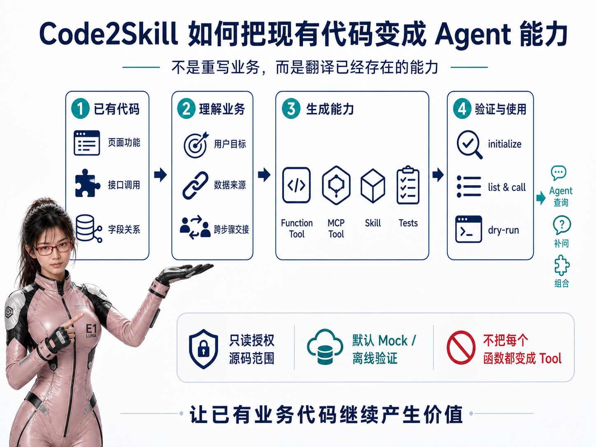
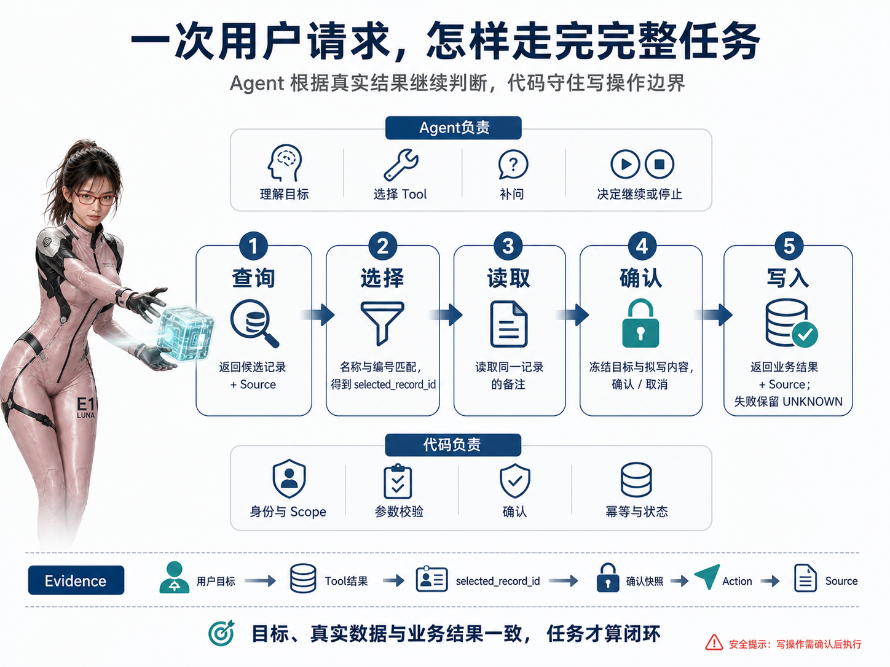
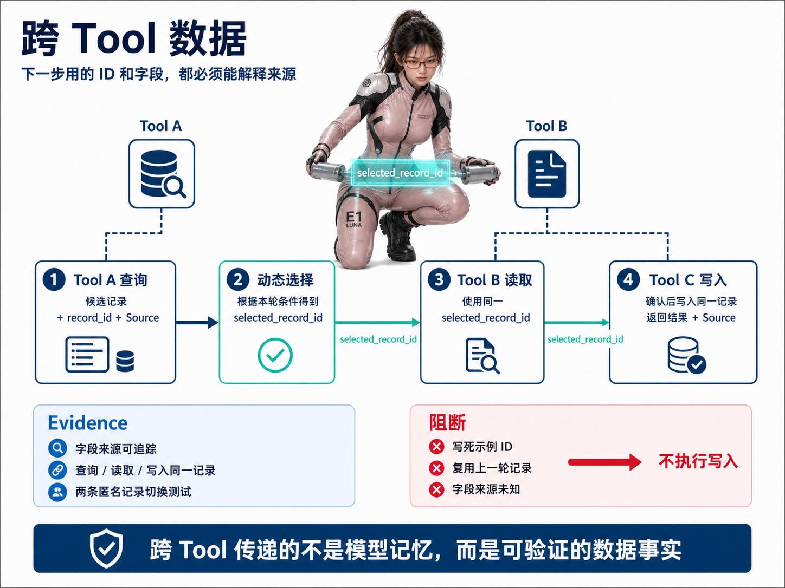
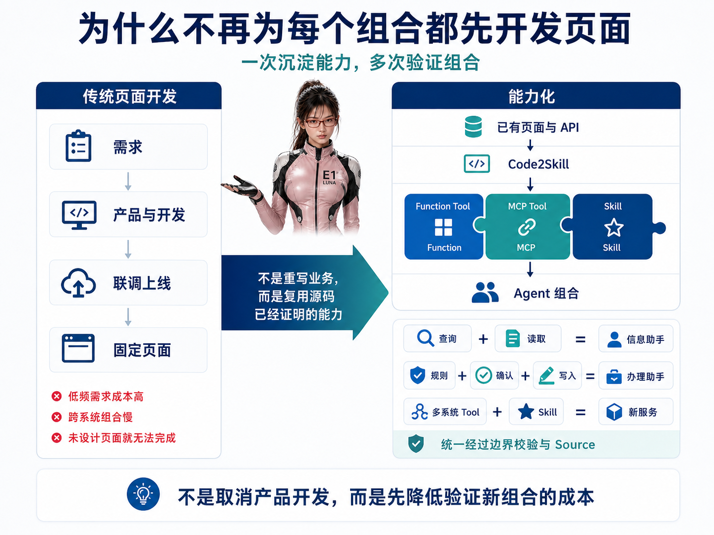
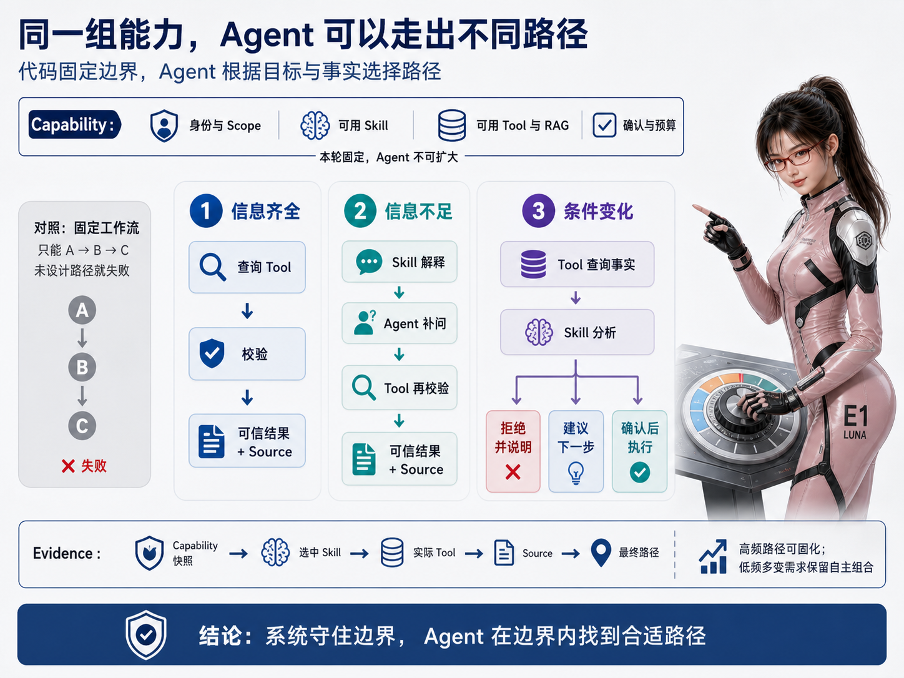
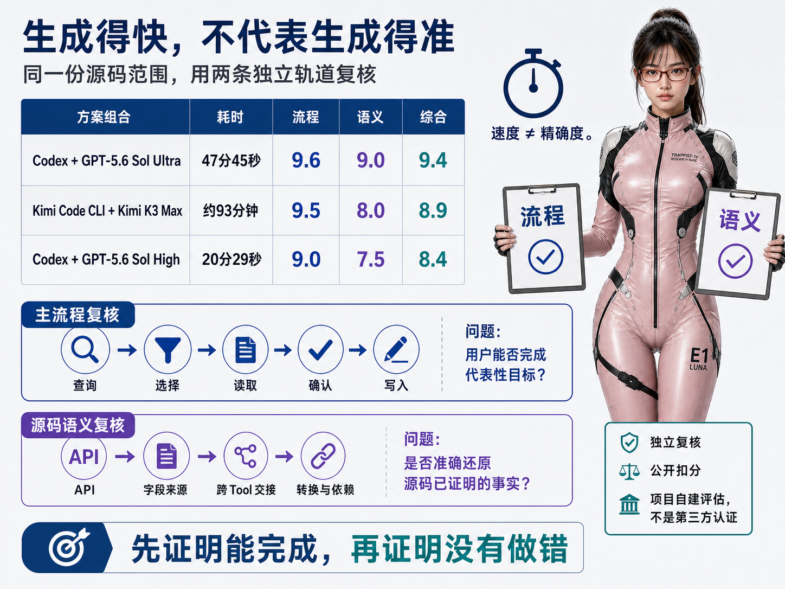
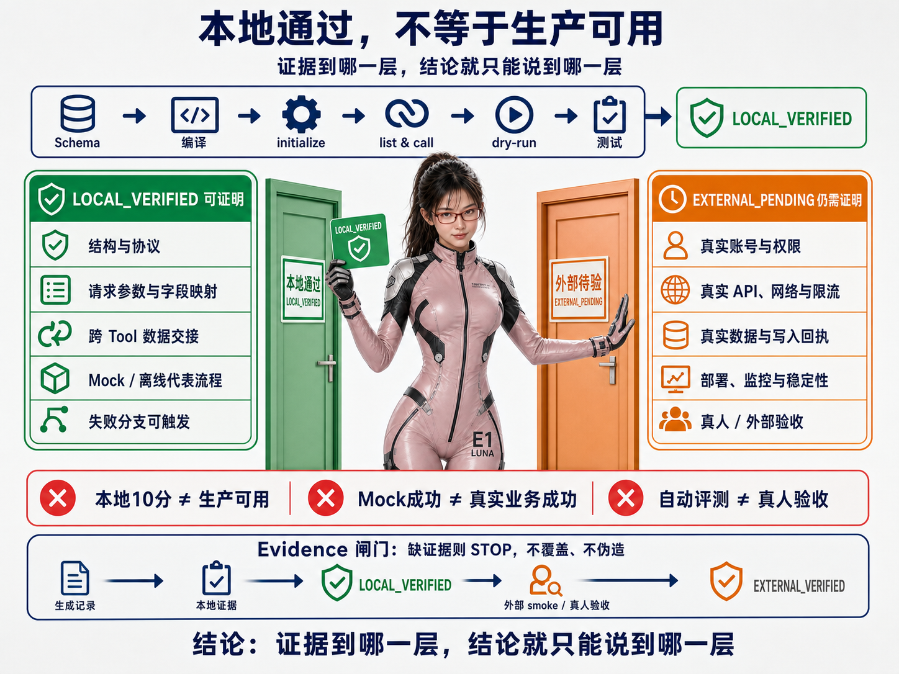

# Code2Skill：不用重写业务接口，把现有代码生成 MCP 和 Agent Skill

最近我一直在研究一个看起来有点反常的问题：很多公司其实并不缺少可以交给 Agent 使用的业务能力，为什么建设 Agent 时，却常常要从头再做一遍？

客户查询、订单处理、售后记录、内部申请、数据统计……接口、字段和流程都已经存在，只是这些能力主要被封装在网页里：

```text
打开系统 → 找到页面 → 填写条件 → 点击按钮 → 查看或提交结果
```

当我们开始建设 Agent 时，常见做法却是重新整理接口文档、重新定义 Tool，再手工编写 MCP Server 和 Skill。已有系统明明每天都在正常运行，接入 Agent 时却像要把业务能力重新开发一遍。

我不太甘心把这些已经被验证过的代码丢在一边，于是产生了一个很直接的想法：

> 已经运行多年的业务代码，能不能直接成为 Agent 能力的来源？

于是，我把这个想法做成了 [Code2Skill](https://github.com/leechen298/Code2Skill)。

Code2Skill 是一组可以安装给编程 Agent 的 Skills。用户指定一个前端页面、功能目录或全栈代码范围后，它会从允许读取的源码中理解业务功能，并生成：

- 可执行的 Function；
- 可通过 MCP 标准发现和调用的 Tools；
- 引导 Agent 收集信息和组合能力的业务 Skill；
- 对应的离线测试与 MCP 注册说明。

当前正式版本是 [v1.0.1](https://github.com/leechen298/Code2Skill/releases/tag/v1.0.1)。



## 先别讲概念，来看一次完整任务

把一个真实形态的业务场景抽象后，可以得到这样的页面功能：

1. 查询记录列表；
2. 查询某条记录的备注；
3. 为选中的记录新增备注。

过去，这些操作需要用户进入后台页面完成。使用 Code2Skill 后，生成结果可以提供三个原子能力，并附带一份告诉 Agent 如何理解目标、补充信息和选择能力的 Skill。

用户可以直接提出：

> 找到名称和编号都匹配的记录，先把现有备注告诉我，再新增一条备注。

Agent 可以根据当前结果逐步完成：

```text
查询列表
  ↓
根据名称与编号核对目标
  ↓
查询目标记录的备注
  ↓
向用户展示写入内容并确认
  ↓
调用新增备注 Tool
  ↓
把后端实际响应交还给用户
```



这里请停一下——这可能是整条链路里最容易被忽略，也最容易真正造成错误的一步。

查询接口返回的“当前选中记录”不能被写成生成时的固定样本。它必须作为动态数据传给后续 Tool。否则第一次测试可能非常顺利，换一条记录却会把请求发给错误的对象。

Code2Skill 的生成规范要求保留这种跨 Tool 数据来源，并要求用两条匿名记录进行切换测试，检查后续请求中没有残留上一条记录的数据。最终是否正确，仍以实际生成结果和测试为准。



这也是我认为“从代码生成”真正有价值的地方：我们需要的不只是三个接口地址，而是接口、页面状态和下一次请求之间的真实关系。只有保留这些关系，生成结果才能从“看起来像一个 Tool”变成真正能够连续完成用户目标的能力。

## 四类产物，别让它们互相抢工作

| 产物 | 职责 |
|---|---|
| Function | 封装接口调用、参数映射、数据交接和确定性格式转换 |
| MCP Tool | 通过 MCP Server 暴露 Function，使 Agent 能够按标准协议发现和调用 |
| Skill | 告诉 Agent 当前目标、所需信息、可用 Tool、常见顺序和停止条件 |
| Tests | 离线验证请求组装、Tool discovery、dry-run 和关键交接行为 |

我特别想强调：Skill 不是一条必须机械执行到底的工作流。

如果用户已经提供了全部信息，Agent 可以直接调用需要的 Tool；信息不足时，Agent 可以逐步询问；后端返回业务错误时，Agent也可以读取实际响应，再决定修正参数、向用户解释或停止。

因此 Code2Skill 的分工是：

> Function 封装确定性执行逻辑，MCP Tool 让能力能够被标准发现和调用，Skill 提供业务使用知识，Agent 结合当前目标自主选择下一步。

## 真正让我兴奋的，是重新组合已有能力

过去，一个业务功能想真正交到业务人员手里，通常需要产品经理先设计完整流程，再由前端开发页面、后端提供接口，最后经过联调、测试和上线。哪怕底层已经存在几个可以复用的查询或操作能力，只要没有被整合进同一个页面，业务人员往往就很难直接使用。

这使很多需求并不是没有价值，而是因为使用频率不够高、涉及多个系统，或者单独开发一个页面的成本太高，最终一直没有被实现。

当已有能力逐步转换成 MCP Tool，并配上说明业务目标和使用方法的 Skill 后，情况会发生变化：Agent 可以根据用户当前的目标，从允许使用的能力中选择并组合需要的部分。

例如，原本分散在不同页面里的查询、计算、记录读取和写入能力，可以在一次任务中被临时组合起来。企业不必为每一种组合都预先开发一套固定页面，低频但有价值的需求也有机会被更快验证，常用组合再逐步沉淀成稳定的 Skill 或正式产品功能。

我很喜欢这种变化：不是一上来就替代产品设计和正式开发，而是先把“验证一种新组合是否有价值”的成本降下来。权限控制、写入确认和业务验收仍然存在，只是不必为每一个想法先造一整套页面。





## 为什么我不满足于再写一份接口文档

接口文档当然很重要，我也不会和它过不去。但在真实项目里，它往往不足以还原一个用户究竟怎样完成工作。

前端代码中经常还存在这些信息：

- 页面真正调用的是哪个接口；
- 某个字段来自用户输入、页面状态，还是上一个接口的返回；
- 同名字段在查询和提交时是否具有不同含义；
- 日期、数组、URL 和枚举在提交前如何转换；
- 哪些接口只属于某个目标，哪些能力可以复用；
- 用户最终是如何完成这项工作的。

所以 Code2Skill 以前端实际调用的后端接口为主要能力来源，再按需读取后端公开的请求和响应结构。它不是看到一个函数就兴奋地包装成 Tool，而是先还原用户目标，再决定哪些原子能力真正值得暴露。

它不会因为在后端搜索到一个内部方法，就自动把它暴露成 MCP Tool；也不会只根据文件名里有没有 `DTO` 来判断数据契约。Request、Response、Schema、Payload、函数参数或运行时对象，都可能是有效证据。

## Code2Skill 是怎样拆解源码的

整体过程可以概括为：

```text
用户指定的页面、功能目录或源码范围
          ↓
识别可以独立完成的主要用户目标
          ↓
追踪前端接口、字段来源和确定性转换
          ↓
按需读取后端公开请求/响应结构
          ↓
生成 Function + MCP Tools + Skills + Tests
          ↓
完成离线验证并报告尚未验证的边界
```

这里也有一个容易误解的地方：用户指定的目录只是搜索范围，不一定等于一个 Skill。

如果一个目录中包含多个独立目标，Code2Skill 可以分别生成多个业务 Skill，并复用共同的 Function 和 MCP Tool。每个 Skill 只描述自己的业务目标，不会因为某个公共接口在其他流程出现过，就把它提升成所有写操作的全局前置步骤。

一份典型的生成结果大致包括：

```text
generated/code2skill/<feature-id>/
├── SKILL.md 或 skills/*/SKILL.md
├── function-core/index.mjs
├── mcp-tool/index.mjs
├── tests/
├── package.json
├── MCP-SETUP.md
└── references/feature-context.md  # 复杂业务才生成
```

其中，`MCP-SETUP.md` 会说明依赖安装、环境变量、启动方式和 MCP 注册步骤。Skill 已生成、MCP 已连接、真实业务已验证，是三个不同的状态。

## 我怎样判断生成质量

为了避免“看起来挺完整”成为唯一判断，我使用同一个包含多个业务目标的前端功能目录，分别通过 Codex 和 Kimi Code CLI 生成了三份结果，并从两个角度进行评估。评分由独立复核任务按照公开扣分规则完成，但仍然是项目自建评估，不是第三方认证。

- **主流程完成度**：用户是否能依靠生成的 Skill、Function 和 MCP 完成主要工作；
- **业务语义精确度**：接口、字段来源、确定性转换和调用关系是否准确还原源码已经证明的事实。

| 生成模型/运行配置 | 生成耗时 | 主流程完成度 | 业务语义精确度 | 综合参考分 |
|---|---:|---:|---:|---:|
| Codex + GPT-5.6 Sol（Ultra 模式） | 47 分 45 秒 | 9.6 | 9.0 | **9.4** |
| Kimi Code CLI + Kimi K3（Max 推理档位） | 约 93 分钟 | 9.5 | 8.0 | **8.9** |
| Codex + GPT-5.6 Sol（High 推理档位） | 20 分 29 秒 | 9.0 | 7.5 | **8.4** |



这张表不是模型排行榜。综合分采用“主流程 60% + 语义精确度 40%”，表达的只是 Code2Skill 当前更重视“先把主要工作做完，同时尽量准确还原源码语义”的产品取向，不是行业标准。

比数字更重要的是边界：三份结果都完成了离线测试、本地 MCP discovery 和独立请求探针，但没有调用真实业务接口或写入生产数据。



因此这里的 9 分以上表示“代码级主要流程基本可用”，不等于“已经生产可用”。完整评分方法、扣分规则和匿名结果记录在[评估报告](https://github.com/leechen298/Code2Skill/blob/main/docs/evaluation.md)中。

## 如果你想现在试一次

Code2Skill 使用通用的 Agent Skills CLI 安装。以 Codex 为例：

```bash
npx skills add leechen298/Code2Skill \
  --skill code2skill-generate \
  --agent codex \
  --global \
  --yes
```

然后在一个已有代码仓库中告诉编程 Agent：

```text
使用 $code2skill-generate，把这个页面转换成 Agent 能力：<页面文件或路由>。
```

安装和发起任务通常很快，但源码分析与产物生成仍需要时间。实际耗时会受到源码范围、模型配置、依赖安装和修正次数影响。

如果是第一次尝试，我会建议你先选：

- 一个范围明确的页面或功能目录；
- 一个只读查询，或者低风险、容易回查的写入功能；
- 前端实际能够正常调用的接口；
- 你自己熟悉、能够判断生成结果是否合理的业务。

需要注意：安装 Code2Skill、安装生成的业务 Skill、安装 MCP 依赖、注册 MCP，以及验证真实业务，是不同的步骤。`npx skills add` 不会替你注入认证信息，也不会自动证明生产接口可用。

Code2Skill 本身也不提供独立的源码上传服务。源码如何被读取、保存和传输，取决于用户选择的编程 Agent、运行环境和部署方式；企业项目应按照自己的代码安全要求选择运行方案。

## 先说清楚，它不适合什么情况

Code2Skill 目前并不承诺：

- 把任意代码一次生成成无需检查的生产系统；
- 100% 还原源码没有表达的业务规则；
- 自动取得真实账号、权限、附件和部署配置；
- 用离线测试代替业务方验收；
- 让所有模型生成完全相同的结果。

我宁愿把这些边界提前讲清楚：真实项目仍然需要熟悉业务的人抽检主要路径，配置运行环境，并在明确授权后测试真实接口。

项目还提供两个可选 Review Skill：

- `code2skill-review-flow`：像用户一样走一遍生成结果，检查主要功能能不能真正完成；
- `code2skill-review-source`：回到原始代码逐项核对，检查接口、字段和请求转换有没有生成错。

它们用于发现高价值问题，不是为了重新建立一套沉重的审计体系。

## 最后，是我真正想验证的一件事

今天很多企业 Agent 项目首先想到的是重新建设知识库、接口和工作流。但面对已经运行多年的企业系统，我更想先做另一件事：盘点那些已经存在、却还没有被 Agent 使用起来的能力。公司已经为这些页面、接口和流程投入了很多开发成本，它们不应该在新的交互方式出现后突然失去价值。

这正是我想通过 Code2Skill 持续验证的方向：

> 不是从零重建一套 Agent 业务系统，而是让现有系统里的能力，以新的方式继续产生价值。

如果你手里也有一个已经运行了一段时间的前端或全栈项目，可以先选一个只读页面，让我陪你试一次。

- GitHub：[leechen298/Code2Skill](https://github.com/leechen298/Code2Skill)
- Release：[Code2Skill v1.0.1](https://github.com/leechen298/Code2Skill/releases/tag/v1.0.1)
- 评估方法：[Code2Skill 生成结果评估](https://github.com/leechen298/Code2Skill/blob/main/docs/evaluation.md)

如果生成失败，可以把脱敏后的目录结构、错误信息和预期目标提交到 Issue。我不会把失败藏在漂亮的演示后面——对这个项目来说，“哪里生成得不够好”与“哪里已经可以真正使用”同样重要。
